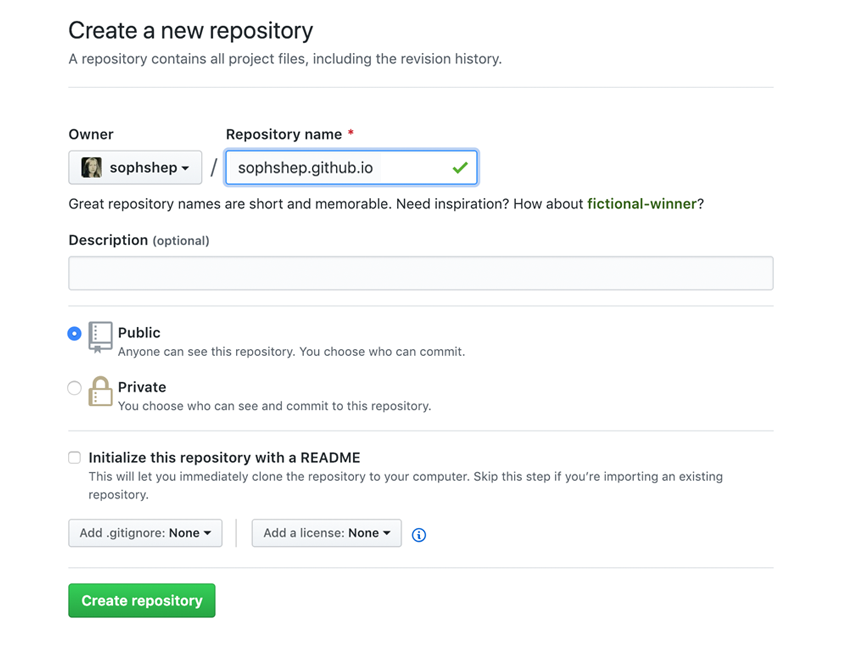

# qaror.uz GitHub Pages
Websites for qaror.uz project, hosted directly from your GitHub repository

## Websites for you and your projects.
Hosted directly from your GitHub repository. Just edit, push, and your changes are live.

## Ready to get started?
Build our qaror.uz site from scratch or generate one for your project.
You get one site per GitHub account and organization, and unlimited project sites.

### Loyihan yaratish bosqichlari

## 1. Create a repository. 
Head over to GitHub and create a new public repository named username.github.io, where username is your username (for example qaroruz) on GitHub.

If the first part of the repository doesn’t exactly match your username, it won’t work, so make sure to get it right.




## 2. Clone the repository

Go to the folder where you want to store your project, and clone the new repository:
```shell
git clone https://github.com/qaroruz/qaroruz.github.io
```

## 3. Hello World

Enter the project folder and add an index.html file:

```shell
cd qaroruz.github.io

echo "Hello World" > index.html
```
## 4. Push it
Add, commit, and push your changes:
```shell
git add --all

git commit -m "Initial commit"

git push -u origin main
```

## 5. Finish
Fire up a browser and go to https://qaroruz.github.io.

